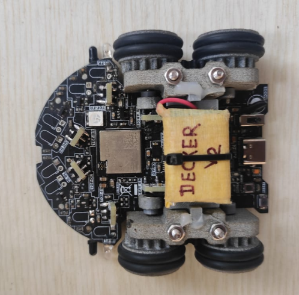
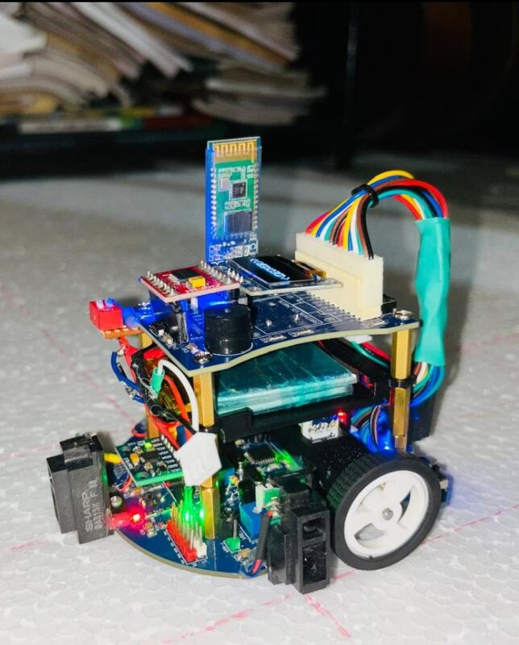
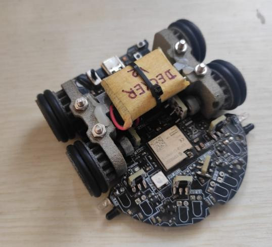

  

# Decker — Maze-Solving Micromouse (V1 & V2)

🏆 **Champion — MicroMaze 2025 (IIT)** &nbsp;·&nbsp; 🥈 **1st Runner-Up — Robofest 2025 (SLIIT), 30s fast run** &nbsp;·&nbsp; Finalist (8th place) — Robofest (V1)

An autonomous maze-solving robot ("Decker") combining Flood Fill path planning
with PID motor control. Built across two full iterations by a 5-person team,
with each version rebuilding the mechanical platform from the ground up.

## Team

5-person team, both versions: **Gamunu Agalawatte**, Dulaj, Ashintha, Lakna, Yesith

## My Role

- **V1** — PCB design (shared with teammates) and physical assembly/stacking of the layered robot system.
- **V2** — Led the mechanical redesign: converted the 2-wheel V1 base into a compact 4-wheel geared drivetrain, and refined the sensor geometry for turn-detection accuracy.

Firmware and the pathfinding/control algorithms (Flood Fill, PID, with PID
tuning modelled in MATLAB) were developed by teammates on both versions —
not authored by me, and not included in this repo.

## V1 → V2: What Changed

| | V1 | V2 |
|---|---|---|
| Drivetrain | 2-wheel base | Compact 4-wheel geared drivetrain — 1200 RPM motors, 3:2 gear ratio, 0.924 m/s top speed |
| MCU architecture | Dual-MCU (separate master + slave chips) | Single ESP32-S3 (dual-core) |
| Sensors | Sharp IR distance sensor + Bluetooth debug link | Refined sensor geometry for turn-detection accuracy |
| Result | Finalist — 8th place, Robofest | 🏆 Champion, MicroMaze 2025 · 🥈 1st Runner-Up, Robofest 2025 (30s fast run) |

## Version 1

  

Layered board stack on a 2-wheel base, with a dual-MCU (master/slave)
architecture, a Sharp analog IR distance sensor for wall detection, and an
onboard Bluetooth module for debug/telemetry.

## Version 2 — "Decker"

  
  

Full mechanical rebuild around a compact 4-wheel geared drivetrain (1200 RPM
motors at a 3:2 gear ratio, 0.924 m/s top speed) and a single ESP32-S3
running both cores, with sensor geometry refined for turn-detection accuracy.

## Demo

**Search run**

<video src="https://github.com/gamunuagalawatte/Micromouse/raw/main/docs/videos/search-run.mp4" controls width="500"></video>

**Fast run**

<video src="https://github.com/gamunuagalawatte/Micromouse/raw/main/docs/videos/fast-run.mp4" controls width="500"></video>

## Tech Stack

PlatformIO · Arduino · EasyEDA · Fusion 360 · Dual-MCU (V1) · ESP32-S3 dual-core (V2)

## Status

Both versions complete and competition-tested. Firmware and the pathfinding
algorithms were developed by teammates and aren't included in this repo.
